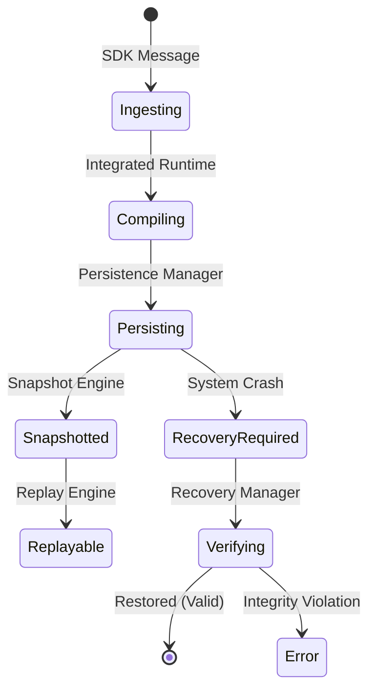

# Persistence & Deployment Architecture

## Overview
The Deployment Architecture (`app/deployment/`) manages the lifecycle of MemLayer states, from in-memory cognition to persistent storage. It provides a deterministic bridge between volatile runtime execution and durable workspace persistence, ensuring tenant isolation and system recovery.

## Core Components

### 1. Deployment Configuration (`app/deployment/deployment_config.py`)
Provides typed, validated configurations for different deployment modes.
- **Modes**:
  - `LOCAL`: Optimized for local developer environments (SQLite/Filesystem).
  - `HOSTED`: Optimized for multi-tenant cloud environments (Async persistence/Compression).
  - `SELF_HOSTED`: Optimized for enterprise on-premise (Higher replay limits/Dedicated volumes).
- **Configurations**: Defines token budgets, coordination depths, and tenant isolation policies.

### 2. Workspace Persistence (`app/deployment/workspace_persistence.py`)
The primary layer for serializing workspace states.
- **Deterministic Serialization**: Uses canonical JSON forms to ensure state checksums are stable across platforms.
- **Integrity Hashing**: Every persisted workspace contains a SHA-256 checksum of its semantic state.
- **Filesystem Storage**: In the current MVP, workspaces are stored as versioned JSON blocks in a dedicated data directory.

### 3. Snapshot Engine (`app/deployment/snapshot_engine.py`)
Enables point-in-time recovery and "Branching" of cognition states.
- **Immutable Snapshots**: Captures a full semantic state, including memories and coordination traces.
- **Branching**: Allows a workspace to be cloned from a historical snapshot for "What-if" analysis or regression testing.

### 4. Recovery Manager (`app/deployment/recovery_manager.py`)
Handles system restoration after failure.
- **Integrity Verification**: Validates persisted states against their checksums before loading them back into the runtime.
- **Conflict Resolution**: Manages divergence between in-memory state and disk state during restoration.

### 5. Tenant Manager (`app/deployment/tenant_manager.py`)
Enforces the primary boundary for security and data isolation.
- **Workspace Bounds**: Ensures a tenant cannot exceed their allocated workspace or memory quotas.
- **Isolation Enforcement**: Wraps every persistence call in a tenant-aware check to prevent cross-contamination.

## Deployment Lifecycle

## Current Deployment Assumptions (Production Blockers)
1.  **Filesystem Persistence**: Currently relies on local directory structures (`.memlayer/data`). For production scaling, this must be migrated to Object Storage (S3/GCS) or a distributed database.
2.  **SQLite Reliance**: Core metadata is stored in `memlayer.db` (SQLite). Production requires PostgreSQL with `pgvector` for scalable semantic search.
3.  **Single-Instance Execution**: The `IntegratedRuntimeSystem` currently assumes a singleton pattern. Distributed deployment will require a shared state bus (Redis/NATS).
4.  **Local Embedding Generation**: Embeddings are generated on the CPU using `sentence-transformers`. High-throughput production will require GPU acceleration or a dedicated embedding service.
5.  **Synchronous I/O**: Many persistence operations currently block the event loop. These must be fully asynchronized for high-concurrency environments.

## Multi-Tenant Boundaries
| Layer | Isolation Strategy |
| :--- | :--- |
| **API** | `tenant_id` required in headers/tokens. |
| **Runtime** | Isolated `WorkspaceSemanticState` per tenant request. |
| **Persistence** | File-level or DB-row-level scoping via `tenant_id`. |
| **Telemetry** | Isolated trace buffers and metric aggregators. |
