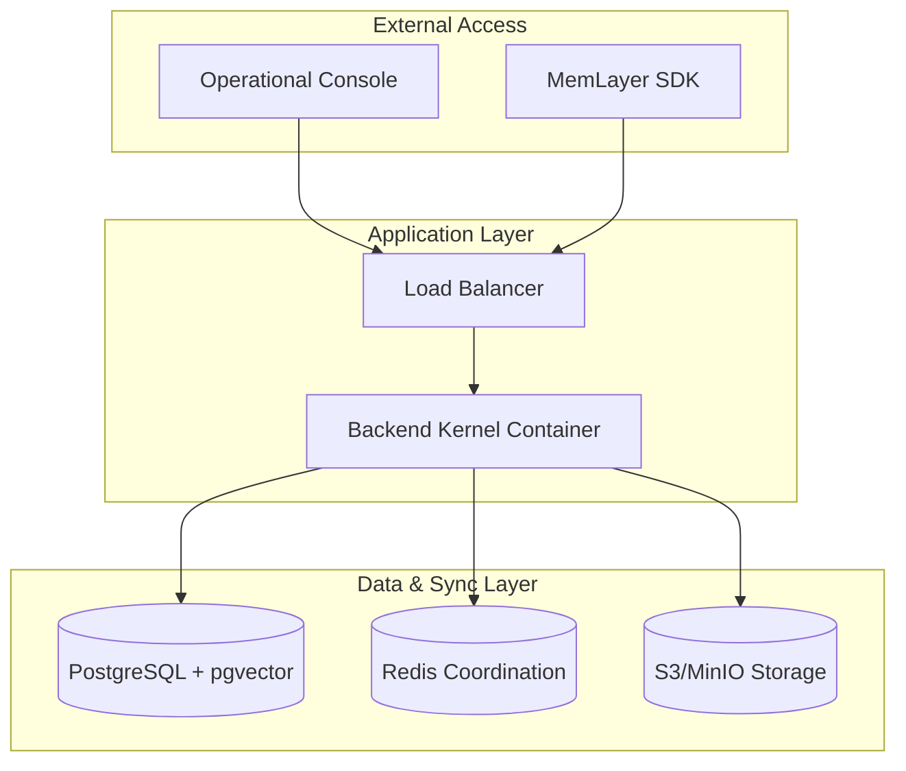

# Deployment Topology — Production Runtime Stack

## 1. Overview
The MemLayer Deployment Topology defines the standard production-capable environment for the cognition runtime. It follows a "Single Logical Runtime" principle, ensuring that all components work together as a deterministic unified system.

## 2. Infrastructure Components

| Component | Role | Technology |
| :--- | :--- | :--- |
| **Backend Kernel** | Cognition Runtime Engine | FastAPI / Python 3.13 |
| **Operational DB** | Persistence Substrate | PostgreSQL 16 + pgvector |
| **Coordination** | Sync & Caching | Redis 7 |
| **Object Store** | Durable Archives | S3 / MinIO |
| **Observability** | Runtime Visibility | Prometheus + OpenTelemetry |

## 3. Network Topology

## 4. Initialization & Bootstrapping
MemLayer uses a deterministic startup sequence to ensure governance integrity:
1.  **DB Check**: Wait for PostgreSQL.
2.  **Migration**: Run Alembic migrations to align schema version.
3.  **Coordination Check**: Verify Redis connectivity.
4.  **Storage Check**: Verify S3 bucket availability.
5.  **Kernel Init**: Instantiate the `IntegratedRuntimeSystem`.
6.  **Trust Verification**: Perform a self-diagnostic on the audit trail and lineage integrity.

## 5. High-Availability (HA) Configuration
- **State Bus**: Redis Sentinel/Cluster for coordination failover.
- **Durable State**: PostgreSQL replication (Primary/Replica) with `pg_auto_failover`.
- **Object Store**: Geo-redundant S3 replication for cognition archives.

## 6. Resource Quotas (Standard Instance)
- **CPU**: 2-4 Cores (mostly for local embedding generation).
- **Memory**: 4-8 GB (to handle large replay traces).
- **Storage**: SSD for hot DB data; S3 for cold archives.

## 7. Containerization
MemLayer is packaged as a standard OCI container (`Dockerfile`), allowing for deployment on Docker Compose, ECS, or bare-metal servers.
