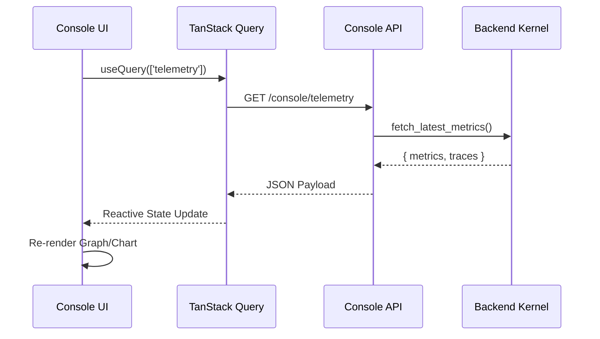

# Frontend Operational Console Architecture

## Overview
The MemLayer Operational Console is a high-density management interface designed for cognition runtime operators. It provides deep visibility into the semantic compilation pipeline, coordination topology, governance lineage, and real-time telemetry. It is built as a deterministic observer of the backend kernel.

## Core Stack
- **Framework**: Next.js 15 (App Router).
- **Visualization**:
  - **React Flow**: Used for rendering Directed Acyclic Graphs (DAGs) of the compiler pipeline and coordination topologies.
  - **Recharts**: Used for high-frequency telemetry dashboards (Token savings, latency histograms).
- **State Management**:
  - **Zustand**: Manages ephemeral client state and UI preferences.
  - **TanStack Query**: Handles server-state synchronization and polling for real-time updates.

## Architectural Principles

### 1. Deterministic Rendering
The frontend contains no internal "intelligence." Every node in a graph, every bar in a chart, and every row in an audit log maps 1:1 to a deterministic identifier from the backend (`trace_id`, `checkpoint_id`, `audit_id`).

### 2. High-Density Observability
The UI prioritizes "Data-over-Design." It avoids consumer-facing patterns (chatbots, prompts) in favor of system-level metrics, raw semantic blocks, and transition traces.

### 3. Replay-Aware Components
Every UI module is "Replay-Aware." If the console is switched to Replay Mode, components automatically render historical trace data using the same visualization logic as live telemetry, ensuring visual consistency during debugging.

## Key Operational Surfaces

### 1. Compiler Pipeline DAG (`/app/compiler`)
Visualizes the step-by-step reduction of raw memories into a compiled context.
- **Nodes**: Represent pipeline stages (Ranking, Allocation, Assembly).
- **Edges**: Represent semantic data flow between stages.
- **Detail Panels**: Show stage-specific metrics (Tokens in/out, duration, notes).

### 2. Coordination Topology (`/app/coordination`)
Renders the interaction graph between specialized agents.
- **Delegation Edges**: Show how tasks move from one role (Researcher) to another (Drafter).
- **Shared State Bus**: Visualizes which agents are consuming which semantic projections.

### 3. Governance Explorer (`/app/governance`)
The interface for the "Trust Layer."
- **Audit Table**: An append-only view of immutable records.
- **Lineage Ancestry Graph**: A zoomable graph showing the derivation of a specific AI conclusion from its constituent memories.

### 4. Telemetry Dashboard (`/app/telemetry`)
Real-time operational monitoring.
- **Token Economics**: Live charts showing raw vs. compressed token throughput.
- **Latency Heatmaps**: Detailed distribution of stage-level performance.

## Frontend-Backend Synchronization

## Scaling Considerations (Frontend)
1.  **Graph Performance**: For workspaces with 1000+ memories, React Flow requires virtualization or level-of-detail (LoD) rendering to maintain 60fps.
2.  **Telemetry Throughput**: High-frequency polling (e.g., < 1s) can saturate the browser's main thread if data processing is not moved to a Web Worker.
3.  **Large Audit Logs**: Audit trails with 10,000+ records require server-side pagination and virtualization in the data grid.
