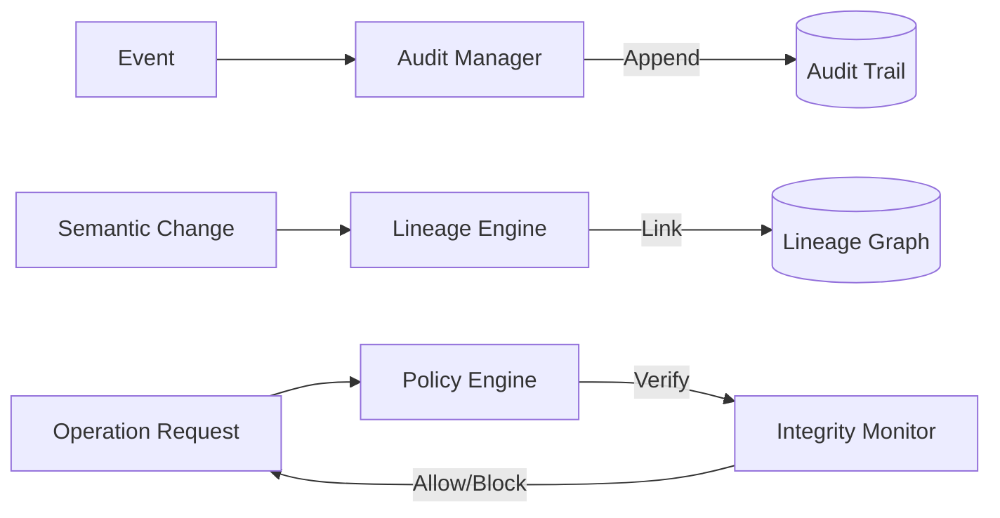

# Governance Architecture: Runtime Trust Infrastructure

## Overview
The Governance Architecture (`app/governance/`) provides the "Trust Layer" for MemLayer. It ensures that every action taken by the AI is auditable, every state transition is traceable, and every operation adheres to defined safety and integrity policies.

## Core Pillars

### 1. Immutable Audit Trail (`app/governance/audit_trail.py`)
An append-only record of all significant runtime events.
- **Event Types**: Coordination completed, Replay triggered, Policy violation, Semantic checkpoint, Recovery initiated.
- **Integrity**: Each record contains a hash of its data, and the trail can be validated for tampering.
- **Tenant Scoping**: Audit trails are isolated by `tenant_id` at the runtime level.

### 2. Semantic Lineage Engine (`app/governance/lineage.py`)
Tracks the evolution of semantic state over time.
- **Checkpoints**: Every time context is compiled or memory is ingested, a `SemanticCheckpoint` is created.
- **Ancestry Graph**: The engine can reconstruct the "Ancestry" of a specific projection, showing exactly which memories and prior states contributed to a current conclusion.
- **Derivation Tracking**: Tracks how one state was derived from another (e.g., a Critic view derived from a Drafter output).

### 3. Runtime Policy Engine (`app/governance/governance_policy.py`)
Enforces deterministic rules at runtime.
- **Replay Integrity Policy**: Prevents execution if the input state doesn't match the historical checksum.
- **Tenant Boundary Policy**: Hard-stops any execution that attempts to cross-reference memories from different `tenant_id`s.
- **Continuity Policy**: Flags executions where semantic continuity falls below a threshold.

### 4. Runtime Integrity Monitor (`app/governance/integrity_monitor.py`)
Continuously validates the system's internal state.
- **Divergence Detection**: Monitors for drift between the persisted database state and the in-memory cognition state.
- **Corruption Detection**: Validates checksums of snapshots and audit records.

## Governance Lifecycle

## Immutable Integrity
MemLayer uses a **"Verify-then-Commit"** pattern for governance:
1.  **Evaluate**: The Policy Engine checks the operation against registered policies.
2.  **Execute**: The operation proceeds only if verified.
3.  **Audit**: The result is committed to the Audit Trail.
4.  **Checkpoint**: The new semantic state is linked in the Lineage Graph.

## Multi-Tenant Governance
Tenant isolation is enforced through **Contextual Scoping**:
- Every governance manager (Audit, Lineage, Policy) requires a `tenant_id` for every operation.
- The retrieval of audit trails and lineage graphs is strictly bounded by the requester's tenant context.
