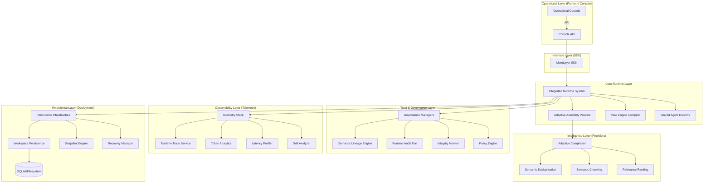

# MemLayer Master Architecture Documentation

## System Purpose
MemLayer is a **deterministic cognition runtime infrastructure platform** designed for persistent, role-specialized AI workspaces. It is not a consumer application but an operational kernel that manages the entire lifecycle of AI context, from ingestion and adaptive compilation to virtualization, coordination, and governance.

## Architectural Layers

## Core Architectural Pillars

### 1. Determinism by Design
Every execution in MemLayer is designed to be **replayable**. By strictly controlling inputs (state checksums, query shaping, deterministic ranking), the system ensures that the same cognition state leads to the identical semantic output, regardless of when or where it is executed.

### 2. Cognition Virtualization
MemLayer separates the **shared workspace state** from the **specialized role-specific views**. This is achieved through the View Engine, which compiles role-optimized semantic projections (Research, Drafter, etc.) from a single source of truth.

### 3. Runtime Trust Infrastructure
Governance is not an afterthought but a core layer of the runtime. Every action is recorded in an immutable audit trail, and every semantic state transition is tracked in a lineage graph, providing 100% observability into how the AI arrived at a specific conclusion.

### 4. Adaptive Intelligence
The system does not use static context windows. It dynamically adapts its context assembly strategy based on:
- **Query Type**: Factual, creative, reasoning, etc.
- **Provider Requirements**: Specific token limits and performance profiles of Claude, OpenAI, or Gemini.
- **Budget Constraints**: Intelligent token allocation across different context layers.

## High-Level Execution Flow

1.  **Ingestion**: Memories (utterances, documents) are stored with local embeddings.
2.  **Request**: A query is received via the SDK/API.
3.  **Compilation**: The `AdaptiveAssemblyPipeline` ranks, chunks, and allocates tokens to form a base context.
4.  **Virtualization**: The `ViewEngineCompiler` projects this base context into specialized role-specific views.
5.  **Coordination**: The `SharedAgentRuntime` orchestrates delegation between views if necessary.
6.  **Telemetry**: Every stage records detailed metrics into the `IntegratedRuntimeSystem`.
7.  **Governance**: Audit records and semantic checkpoints are committed.
8.  **Persistence**: The resulting state and traces are snapshotted for potential replay or recovery.
9.  **Visualization**: The `Operational Console` renders the live graph and metrics for the operator.

## Directory Mapping
| Path | Responsibility |
| :--- | :--- |
| `app/runtime/` | Core execution loop and system integration. |
| `app/compiler/` | Context compilation, ranking, and allocation. |
| `app/view_engine/` | Role-specific semantic projections. |
| `app/agent_runtime/` | Multi-view coordination and state bus. |
| `app/governance/` | Audit, lineage, policies, and integrity. |
| `app/telemetry/` | Observability, profiling, and benchmarking. |
| `app/deployment/` | Persistence, snapshots, and tenant isolation. |
| `app/sdk/` | High-level interface for integration. |
| `app/api/` | REST endpoints for the operational console. |
| `frontend/` | Next.js operational operating console. |
