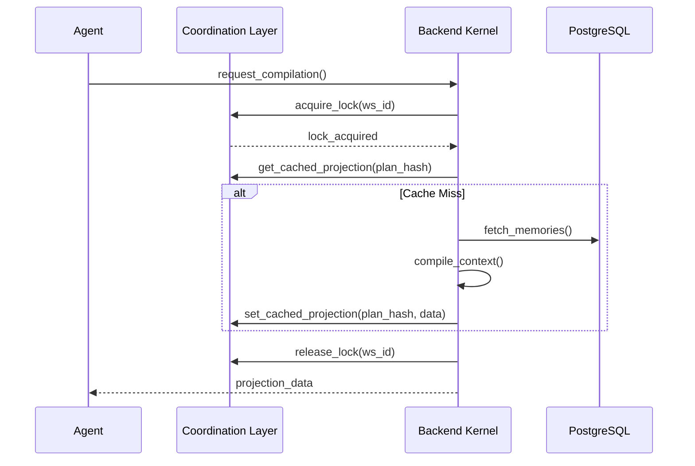

# Redis Coordination Architecture — Distributed Runtime Synchronization

## 1. Overview
Redis is utilized as the ephemeral coordination layer for MemLayer. It is NOT a source-of-truth store, but a high-speed synchronization plane for distributed runtime operations, coordination locking, and semantic projection caching.

## 2. Core Responsibilities

### 2.1. Distributed Locking
Prevents concurrent workspace corruption during multi-agent coordination.
- **Key Pattern**: `lock:workspace:{workspace_id}`
- **Behavior**: Mutual exclusion with automatic TTL (Time-to-Live) to prevent deadlocks in case of worker failure.

### 2.2. Projection Caching
Reduces the computational and token cost of repeated context compilations.
- **Key Pattern**: `projection:{projection_id}`
- **TTL**: 1 hour (configurable).
- **Consistency**: The cache is invalidated immediately if the underlying `WorkspaceSemanticState` changes.

### 2.3. Ephemeral Session State
Tracks the "active thought" of agents across distributed workers.
- **Key Pattern**: `session:{session_id}`
- **Goal**: Allows an agent to "resume" a reasoning thread on a different server instance without re-fetching historical state from the database.

## 3. Operational Invariants

- **Non-Persistence**: No critical cognition data is stored *only* in Redis. Redis data is considered volatile and can be re-generated from PostgreSQL at any time.
- **Serialization**: Data is stored as minified JSON to optimize throughput.
- **Isolation**: Every key is prefixed by the `tenant_id` if the Redis instance is shared across tenants.

## 4. Runtime Coordination Flow

## 5. Deployment Scaling
In production, a Redis Cluster or high-availability Sentinels are used to ensure the coordination plane remains available even during partial network partitions.
