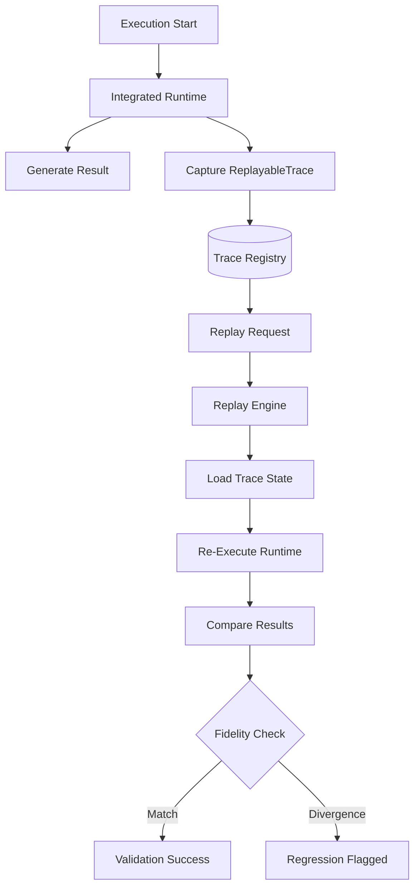

# Replay Architecture: Deterministic Reproducibility

## Overview
MemLayer's Replay Architecture (`app/runtime/replay_engine.py`) is a core differentiator. It provides the ability to reproduce any historical cognition execution bit-for-bit, enabling debugging, regression testing, and provider behavior validation.

## The Replayable Trace
The foundation of replay is the `ReplayableTrace`. Unlike a standard log, a trace contains all the necessary state to recreate the environment exactly as it was:
- **Input Parameters**: Query, provider, compression mode, token budget.
- **Cognition State**: IDs of all memories that were available at the time of execution.
- **Stage Metadata**: Checksums and metrics for every pipeline stage (Ranking, Allocation, etc.).
- **Integrity Checksum**: A SHA-256 hash of the input state to ensure the environment hasn't been tampered with.

## Core Components

### 1. Runtime Replay Engine (`app/runtime/replay_engine.py`)
- **Trace Storage**: Persists historical traces in an append-only registry.
- **Trace RETRIEVAL**: Allows operators to query traces by ID, provider, or query type.
- **Replay Simulation**: Re-executes the runtime with the exact parameters from a trace and compares the new result with the original.

### 2. Trace Comparison Engine
- **Fidelity Scoring**: Computes a score (0-100) representing how closely the replayed result matches the original.
- **Regression Detection**: Automatically flags executions where quality scores or semantic retention diverge by more than 5-10% from the baseline.

## Replay Workflow

## Determinism Guarantees
To achieve 1.0 replay determinism, MemLayer enforces:
- **Stable State Checksums**: The `WorkspaceSemanticState` must generate an identical checksum if the underlying memories are unchanged.
- **Deterministic Ranking**: The relevance scoring must not contain random walk components or non-deterministic weightings.
- **ISO 8601 UTC Timestamps**: All time-based calculations use fixed-format UTC to avoid timezone or platform drift.
- **Canonical Serialization**: All JSON data is serialized using a stable key-ordering (canonical form).

## Use Cases
1.  **Debugging**: Reproduce a specific failure reported by a user by replaying their trace ID.
2.  **Provider Validation**: Replay a "Golden Set" of traces against a new LLM provider version to measure behavioral drift.
3.  **Regression Testing**: Ensure that new architectural changes in the compiler do not degrade quality for historical workloads.
