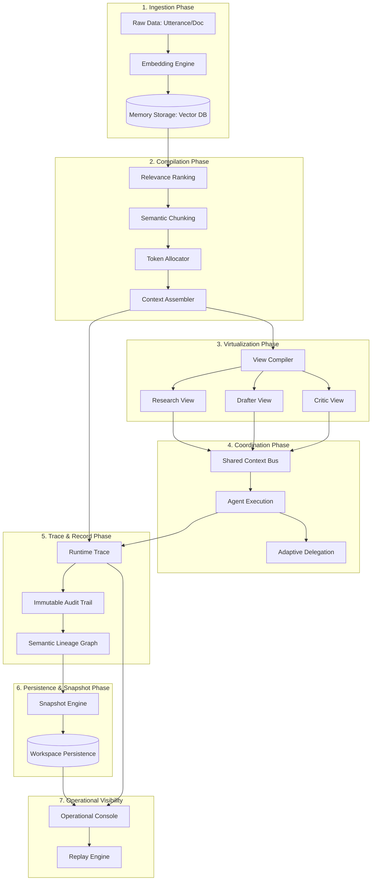

# Runtime Data Lifecycle: The Journey of Cognition

## Overview
This document traces the complete lifecycle of cognition data within MemLayer, from raw ingestion to persistent governance and operational visualization.

## The Cognition Flow

## Phase Transitions

### 1. Raw Data → Semantic Memory
- **Trigger**: SDK `ingest_memory()` or CLI import.
- **Transformation**: Text is processed by `sentence-transformers` into 384-dimensional vectors.
- **Outcome**: A `Memory` object with raw content, summary, and embedding.

### 2. Memory → Compiled Context
- **Trigger**: A query request to the `IntegratedRuntimeSystem`.
- **Transformation**: Thousands of memories are ranked, deduplicated, and compressed into a < 4000 token context block.
- **Outcome**: A `CompilationPlan` and a `CompiledContext` string.

### 3. Compiled Context → Specialized View
- **Trigger**: Role-specific request (e.g., "Research").
- **Transformation**: The context is shaped by `ViewEngineCompiler` into provider-aware projections (e.g., optimized for Claude).
- **Outcome**: A `SemanticProjection` with role-specific sectioning.

### 4. Projection → Coordinated Action
- **Trigger**: Multi-agent task execution.
- **Transformation**: Multiple agents consume projections from the `SharedContextBus` and produce outputs.
- **Outcome**: `AgentExecutionResult` and delegation handoffs.

### 5. Execution → Governance & Audit
- **Trigger**: Completion of a coordination cycle.
- **Transformation**: Execution metadata is hashed and appended to the `AuditTrail`. Semantic state changes are linked in `SemanticLineage`.
- **Outcome**: Immutable proof of the AI's reasoning chain.

### 6. Trace → Replayable Snapshot
- **Trigger**: Automatic `auto_persist` or manual `create_snapshot()`.
- **Transformation**: The entire workspace state and execution traces are serialized to JSON.
- **Outcome**: A `PersistedWorkspace` block ready for bit-for-bit reproduction.

## Data Immutability Guarantees
- **Memories**: Once ingested, raw content is immutable; only metadata (summaries, importance) can be updated.
- **Audit Records**: Once written, records are frozen and protected by integrity hashes.
- **Snapshots**: Historical snapshots are never overwritten; new snapshots create new versioned files.
- **Traces**: Telemetry traces are append-only and linked to specific `trace_id`s.
