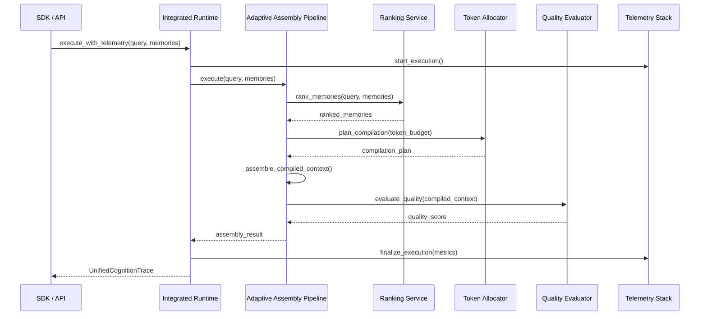

# Semantic Runtime Architecture

## Overview
The Semantic Runtime is the "brain" of MemLayer. It is responsible for transforming raw, high-dimensional memory states into optimized, role-specific contexts for AI models. This process is driven by the `AdaptiveAssemblyPipeline` and integrated via the `IntegratedRuntimeSystem`.

## Core Components

### 1. Adaptive Assembly Pipeline (`app/compiler/`)
The pipeline executes a multi-stage semantic reduction process:

1.  **Semantic Deduplication**: Identifies and merges redundant memories using embedding similarity thresholds.
2.  **Semantic Chunking**: Groups related memories into thematic blocks to preserve reasoning continuity.
3.  **Relevance Ranking**: Scores memories based on semantic proximity to the current query, workspace state, and role requirements.
4.  **Token Budget Allocation**: Intelligently distributes the total token budget across different layers (Reasoning, Memories, Workspace Summary).
5.  **Context Assembly**: Synthesizes the final Markdown-formatted context layers.

### 2. Integrated Runtime System (`app/runtime/`)
The `IntegratedRuntimeSystem` orchestrates the pipeline and ensures it is fully observable.
- **Unified Cognition Trace**: Every execution produces a `UnifiedCognitionTrace` containing the input query, assembly result, telemetry identifiers, and quality metrics.
- **Telemetry Hooking**: Automatically triggers tracing, profiling, and benchmarking for every pipeline stage.
- **Governance Hooking**: Records lineage checkpoints and audit events during execution.

## Runtime Execution Lifecycle

## Optimization Strategies

### 1. Token Budgeting
The `TokenBudgetAllocator` uses a priority-based system:
- **High Priority**: Direct query matches and critical reasoning context.
- **Medium Priority**: Thematic neighbors and recent workspace summaries.
- **Low Priority**: Background context and older memories.

### 2. Compression Strategies
MemLayer supports multiple compression modes:
- **Balanced (Default)**: Summarization of long memories while preserving core entities.
- **Aggressive**: Lossy semantic compression for large-scale memory retrieval.
- **Minimal**: Preserves raw content with minimal filtering.

## Semantic Invariants
1.  **Ranking Determinism**: For a fixed state and query, the ranking order must be identical across runs.
2.  **Context Continuity**: Compiled context must maintain the original chronological or logical order of reasoning.
3.  **Tenant Boundary Isolation**: Compilation must NEVER include memories from a different tenant.
