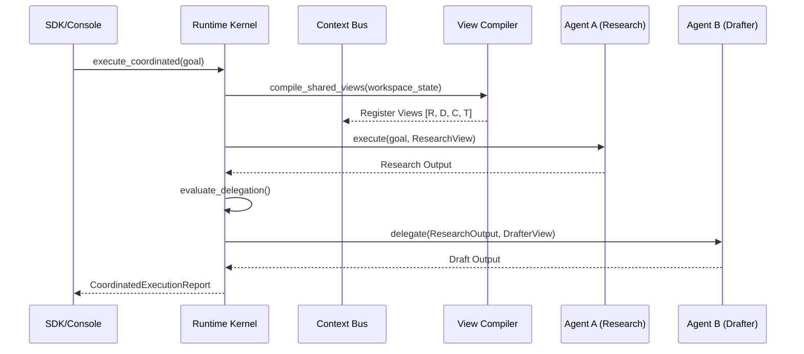

# Shared Coordination Runtime Architecture

## Overview
The Shared Coordination Runtime (`app/agent_runtime/`) enables multiple specialized agents to operate within a unified cognition environment. It ensures that agents coordinate their activities, share semantic context, and delegate tasks efficiently without redundant context compilation or conflicting states.

## Key Principles
- **Shared Cognition Substrate**: All agents in a workspace consume the same compiled semantic projections from a shared bus. No agent independently rebuilds context.
- **Deterministic Delegation**: Handoffs between agents (e.g., Researcher to Drafter) are governed by deterministic policies and tracked for continuity.
- **Token Economy**: The runtime optimizes token usage by reusing projections across multiple agent executions.

## Core Components

### 1. Runtime Kernel (`app/agent_runtime/runtime_kernel.py`)
The orchestrator for multi-agent runs.
- **Coordinated Execution**: Manages the lifecycle of multiple agents responding to a single high-level goal.
- **Execution Reports**: Generates `CoordinatedExecutionReport` with aggregated token savings, reuse ratios, and semantic continuity metrics.

### 2. Shared Context Bus (`app/agent_runtime/context_bus.py`)
The central registry for all compiled semantic views.
- **View Access**: Agents subscribe to specific views (Research, Critic, etc.) and retrieve the latest compiled projection.
- **Reuse Tracking**: Monitors how many times a single compilation pass is consumed by different agents.

### 3. Adaptive Delegation (`app/agent_runtime/adaptive_delegation.py`)
The logic for determining when and to whom a task should be delegated.
- **Delegation Runtime**: Manages the "handshake" between agents, ensuring the target agent receives the necessary state from the source agent.
- **Continuity Scoring**: Measures the semantic overlap between source and target outputs to ensure the reasoning chain is not broken.

### 4. Agent State Registry (`app/agent_runtime/agent_registry.py`)
Tracks the status, capabilities, and execution history of all agents in the runtime.
- **Lifecycle Management**: Tracks agents from registration through idle, executing, and delegated states.

## Coordination Lifecycle

## Budget and Policy
- **Budget Optimizer**: Prevents a single agent from exhausting the workspace token budget during multi-turn coordination.
- **Coordination Policy**: Enforces rules such as "Critic must always follow Drafter" or "Research results must be refreshed after 3 turns."
