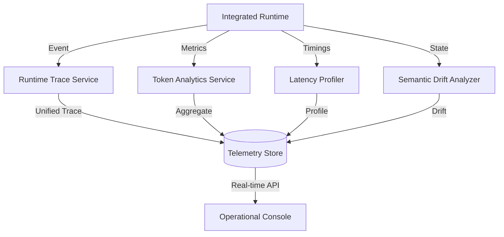

# Telemetry Architecture: Real-time Observability

## Overview
The Telemetry Architecture (`app/telemetry/`) provides high-fidelity, real-time observability into the MemLayer runtime. It tracks token economics, latency profiles, semantic drift, and provider performance, enabling operators to optimize the cognition substrate.

## Core Components

### 1. Runtime Trace Service (`app/telemetry/runtime_trace.py`)
Records the granular step-by-step execution of every runtime operation.
- **Trace Stages**: Maps to pipeline stages (Ranking, Allocation, Assembly, etc.).
- **Metadata**: Captures stage-specific details like memory delta bytes and input/output counts.
- **Visualization**: Generates the data used for the DAG visualization in the Operational Console.

### 2. Token Analytics Service (`app/telemetry/token_analytics.py`)
Tracks the "Token Economy" of the system.
- **Efficiency Metrics**: Calculates tokens saved through deduplication and shared view reuse.
- **Semantic Density**: Measures the "information per token" ratio of compiled context.
- **Economic Reporting**: Provides aggregate reports on token consumption by provider and query type.

### 3. Latency Profiler (`app/telemetry/latency_profiler.py`)
Monitors the temporal performance of the runtime.
- **Stage Latency**: Measures the duration of every stage in the compilation pipeline.
- **P95 Tracking**: Identifies performance outliers and bottlenecks in the ranking or assembly layers.
- **System Overhead**: Calculates the latency added by telemetry and governance layers themselves.

### 4. Semantic Drift Analyzer (`app/telemetry/semantic_drift.py`)
Monitors the "Meaning Integrity" of the context.
- **Drift Scoring**: Measures the semantic distance between the raw memory state and the final compiled projection.
- **Quality Correlation**: Correlates drift with user-reported or auto-evaluated quality scores.

### 5. Provider Benchmarking Service (`app/telemetry/provider_benchmarking.py`)
Compares the performance of different LLM providers (Claude, OpenAI, Gemini).
- **Cost-to-Quality Ratio**: Ranks providers based on semantic retention vs. token cost.
- **Stability Monitoring**: Detects sudden drops in provider response quality or availability.

## Telemetry Flow

## Real-time Synchronization
MemLayer uses a **"Zero-Latency-Impact"** telemetry model:
1.  **Buffer**: Metrics are buffered in-memory during execution.
2.  **Async Flush**: Buffers are flushed to persistence or the API layer asynchronously after the core execution completes.
3.  **Deterministic Sync**: Telemetry identifiers (`trace_id`, `profile_id`) are linked to governance identifiers (`checkpoint_id`, `audit_id`) to ensure a unified view of every event.

## Key Metrics Captured
| Metric | Description | Target |
| :--- | :--- | :--- |
| **Token Savings Ratio** | (Raw Tokens - Compiled Tokens) / Raw Tokens | > 90% |
| **Semantic Retention** | Preservation of key factual nodes after compression | > 85% |
| **P95 Latency** | Time to compile context for 100+ memories | < 500ms |
| **Replay Fidelity** | Matching degree of replayed vs. original result | 1.0 (100%) |
| **Isolation Integrity** | Zero cross-tenant memory leaks detected | 100% |
