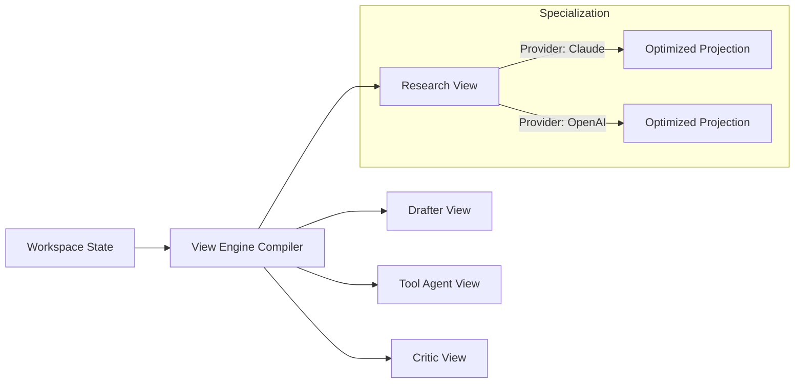

# View Engine Architecture: Cognition Virtualization

## Overview
The View Engine is MemLayer's "cognition virtualization" layer. It allows multiple specialized AI agents (or roles) to consume a single shared workspace state through customized "semantic projections."

## Core Concepts

### 1. Semantic Projections
Instead of providing the same raw context to every agent, the View Engine "projects" the workspace state into a structure optimized for the agent's specific role.
- **Research View**: Optimized for information retrieval, factual density, and source citation.
- **Drafter View**: Optimized for synthesis, narrative flow, and reasoning continuity.
- **Tool Agent View**: Optimized for parameter extraction, API surface awareness, and action-oriented state.
- **Critic View**: Optimized for contradiction detection, quality assessment, and logical verification.

### 2. View Engine Compiler (`app/view_engine/compiler.py`)
The compiler takes a `WorkspaceSemanticState` and a `ViewDefinition` to produce a `SemanticProjection`.
- **Provider Shaping**: Adjusts context formatting (e.g., XML for Claude, JSON-like Markdown for OpenAI/Gemini) and token allocation based on the target model's strengths.
- **Objective Resolution**: Weights memory relevance differently based on the view's objective (e.g., factual search vs. reasoning synthesis).

## Components

### 1. View Definitions (`app/view_engine/definitions.py`)
Defines the "contracts" for each view type, including objectives, token distribution preferences, and provider-specific profiles.

### 2. Projection Engine (`app/view_engine/projection.py`)
Handles the actual transformation of ranked memories into the final view structure. It ensures that projections are deterministic and tracks section-level divergence between views.

### 3. Quality Evaluator (`app/view_engine/quality.py`)
Scores each projection on role-specific effectiveness. For example, a Research View is scored higher if it includes more diverse factual nodes, while a Critic View is scored higher for finding contradictions.

## Virtualization Flow

## Replay and Determinism
- **Derivation Lineage**: Each projection is linked to the specific base state it was derived from.
- **Projection Checksums**: Every compiled view has a unique checksum to ensure identical re-compilation during replay.
- **Divergence Monitoring**: The engine monitors how much views overlap or diverge to identify "cognitive drift" across the agent pool.
